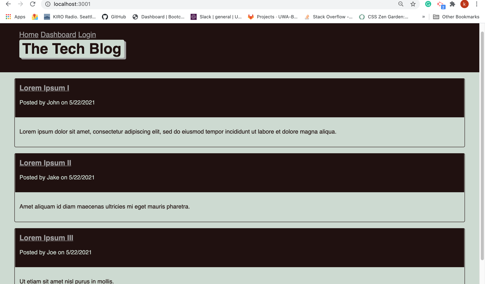
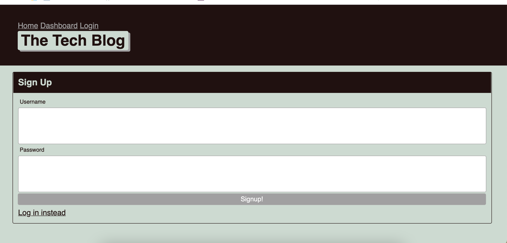

# Tech Blog

## Description 

This is a project which was developed for the University of Arizona Coding Bootcamp course. The application contained within is a CMS-style blog site similar to a Wordpress site, where developers can publish their blog posts and comment on other developers’ posts as well. The app follows the MVC paradigm in its architectural structure, using Handlebars.js as the templating language, Sequelize as the ORM, and the express-session npm package for authentication.

## Table of Contents 

* [Usage](#usage)
* [Documentation](#documentation)
* [Credits](#credits)
* [License](#license)

## Usage 

Clone the repo, navigate to the root folder, run the following commands from the CLI:     

Run Test;    
`npm run test`     

Seed DB;   
`npm run seed`     

Start Server;     
`npm start server` 

## Documentation

Example of front page

An example of log in

https://radiant-earth-96694.herokuapp.com/

## Questions
If you have any questions about the repo, please [open an issue](https://github.com/Ofarrell23/tech-blog/issues or contact me via email at keyabug@gmail.com. You can find more of my work on my GitHub, [Ofarrell23](https://github.com/Ofarrell23/).
    
## Credits
Below is a list of third-party tutorials used to help facilitate this project. There were no collaborators for this project.

* [Credits] (https://www.w3schools.com/tags/att_img_alt.asp)
* [Credits] (https://www.vikingcodeschool.com/html5-and-css3/html5-semantic-tags)
* [Credits] (https://developer.mozilla.org/en-US/docs/Web/JavaScript)

# License

